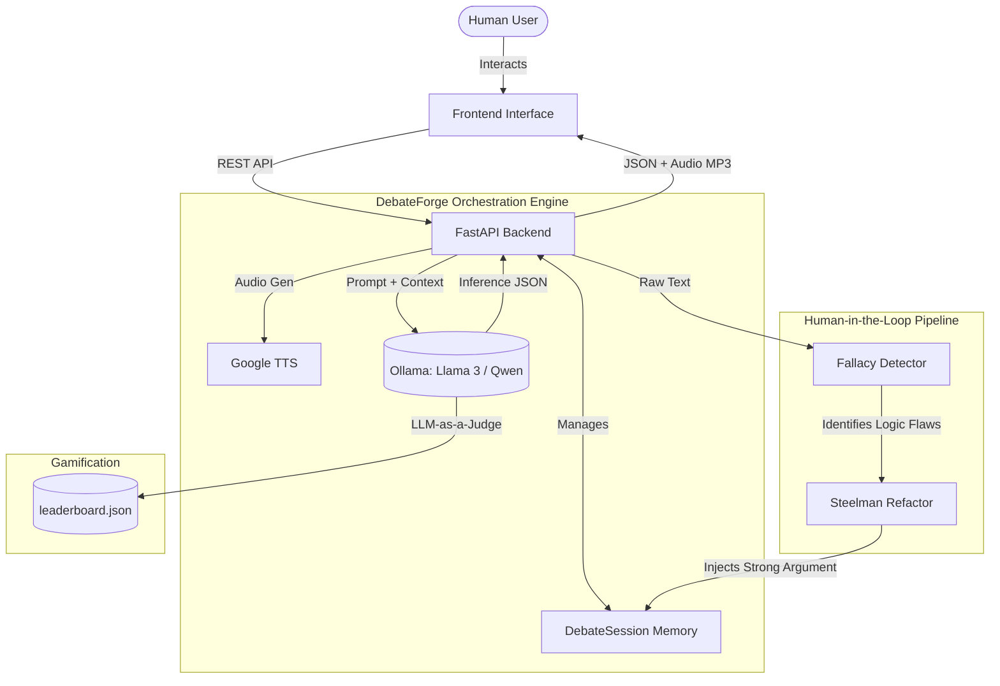

# 🎙️ DebateForge: Autonomous Multi-Agent AI Debate System

   

**DebateForge** is a stateful, multi-agent AI debate platform designed to act as an aggressive, real-time sparring partner for Group Discussion (GD) and interview preparation. 

## 📖 The Origin Story
Standard AI chatbots are built for subservience—they generate walls of text when you ask them for topics. But reading a list of bullet points doesn't prepare you for the real-time pressure, interruptions, and logical clashes of a high-stakes Group Discussion. 

I didn't need a text generator. I needed a relentless, vocal sparring partner to test my logic on the fly. I needed someone to argue with me and call out my bad logic. That didn't exist... so I built it.

## 🏗️ System Architecture



## ✨ Core Features

* **Autonomous Multi-Agent Debates:** Two AI models debate complex topics autonomously in real-time.
* **Dynamic Personas:** System prompting forces the AI into specific psychological profiles that never break character:
    * 🎓 **The Professor:** Highly analytical, elite academic tone.
    * 🧌 **The Troll:** Dismissive, slang-heavy, intentionally frustrating but logically sound.
    * 🔥 **The Aggressor & 🏛️ The Philosopher.**
* **Real-Time NLP Interruption (The Sandbox):** Humans can pause the loop and inject their own arguments.
    * *Fallacy Detection:* The engine flags logical flaws (Ad Hominem, Straw Man) in the human's input.
    * *Steelman Protocol:* Strips away human emotion and rewrites the argument into its strongest logical form before injecting it into the debate.
* **LLM-as-a-Judge:** An impartial AI evaluates the full transcript, declares a winner based on logical merit, and updates a persistent leaderboard with custom "brag quotes".
* **Integrated Voice:** Zero-latency Text-to-Speech (TTS) forces active listening instead of passive reading.

## 🛠️ Tech Stack

* **Frontend:** React / HTML+JS (Tailwind CSS)
* **Backend:** Python, FastAPI
* **AI/Inference:** Ollama (Running local Llama 3 / Qwen 3.5 models via consumer GPU)
* **Audio:** `gTTS` (Google Text-to-Speech)

## 🚀 Local Setup & Installation

### 1. Prerequisites
* Python 3.10+
* [Ollama](https://ollama.com/) installed on your machine.
* At least 8GB of RAM (A dedicated GPU is recommended for faster token generation).

### 2. Start the AI Engine
Open a terminal and pull your preferred model. Leave this running in the background to keep the model warm in VRAM.
```bash
# We recommend Llama 3 or Qwen 3.5 (4B/9B)
ollama run llama3 
```

### 3. Backend Setup
Clone the repository and install the dependencies:
```bash
git clone [https://github.com/prajjwal-17/AI-Debate-System.git](https://github.com/prajjwal-17/AI-Debate-System.git)
cd AI-Debate-System/backend

# Create a virtual environment
python -m venv venv
source venv/bin/activate  # On Windows use `venv\Scripts\activate`

# Install requirements
pip install fastapi uvicorn pydantic gtts

# Run the server
uvicorn main:app --reload
```
The backend will now be running at `http://localhost:8000`. You can access the interactive API documentation at `http://localhost:8000/docs`.

### 4. Frontend Setup
```bash
cd ../frontend
# Add your specific frontend run commands here (e.g., npm install && npm start)
```

## 📡 API Endpoints Overview

| Method | Endpoint | Description |
| :--- | :--- | :--- |
| `POST` | `/api/debate/start` | Initializes a new debate session, assigns personas, and returns Turn 1. |
| `POST` | `/api/debate/next` | Generates the next turn in the autonomous AI loop. |
| `POST` | `/api/debate/interrupt` | Receives human text, runs Fallacy/Steelman NLP, and updates the state. |
| `POST` | `/api/debate/judge` | Ends the debate, evaluates the winner, and updates the leaderboard. |

## 🔮 Future Roadmap
- [ ] **Zero-Latency Look-Ahead Buffer:** Implement FastAPI background tasks to pre-compute AI responses asynchronously while audio plays.
- [ ] **Indic Multilingual Support:** Expand dynamic prompts to allow agents to debate natively in Hindi, Bengali, Tamil, and Telugu.

---
*Built to win arguments. Engineered to run locally.*
