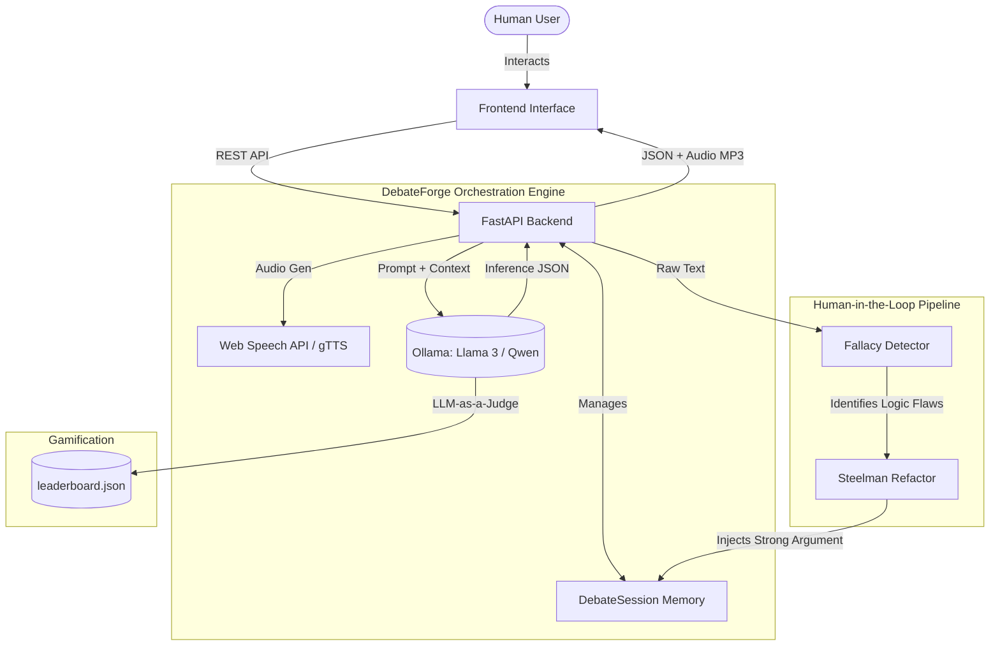

# 🎙️ DebateForge: Autonomous Multi-Agent AI Debate System

   

**DebateForge** is a stateful, multi-agent AI debate platform designed to act as an aggressive, real-time sparring partner for Group Discussion (GD) and interview preparation. 


## 📖 The Origin Story
Standard AI chatbots are built for subservience—they generate walls of text when you ask them for topics. But reading a list of bullet points doesn't prepare you for the real-time pressure, interruptions, and logical clashes of a high-stakes Group Discussion. 

I didn't need a text generator. I needed a relentless, vocal sparring partner to test my logic on the fly. I needed someone to argue with me and call out my bad logic. That didn't exist... so I built it.

## 🏗️ System Architecture



## ✨ Core Features

### 1. Autonomous Multi-Agent Debates
Set a topic, pick your fighters, and watch two AI models debate complex subjects autonomously in real-time.


### 2. Dynamic Personas
System prompting forces the AI into specific psychological profiles that never break character. 
* 🎓 **The Professor:** Highly analytical, elite academic tone.
* 🧌 **The Troll:** Dismissive, slang-heavy, intentionally frustrating but logically sound.
* 🔥 **The Aggressor & 🏛️ The Philosopher.**


### 3. Real-Time NLP Interruption (The Sandbox)
Humans can pause the autonomous loop at any time and type their own arguments to attack either persona. 
* **Fallacy Detection:** The engine instantly flags logical flaws (e.g., False Dichotomy, Ad Hominem) in the human's input.
* **Steelman Protocol:** Strips away human emotion and rewrites the argument into its strongest logical form before injecting it into the debate state.


### 4. LLM-as-a-Judge & Multilingual Support
An impartial AI evaluates the full transcript, declares a winner based on logical merit, and updates a persistent leaderboard. The platform also features multilingual support (e.g., Hindi) for broader accessibility.


## 🛠️ Tech Stack

* **Frontend:** NextJS, Tailwind CSS) & Framer Motion
* **Backend:** Python, FastAPI
* **AI/Inference:** Ollama (Running local Llama 3)
* **Audio:** Web Speech API / `gTTS`

## 🚀 Local Setup & Installation

### 1. Prerequisites
* Python 3.10+
* [Ollama](https://ollama.com/) installed on your machine.
* At least 8GB of RAM (A dedicated GPU is recommended for faster token generation).

### 2. Start the AI Engine
Open a terminal and pull your preferred model. Leave this running in the background to keep the model warm in VRAM.
```bash
# We recommend Llama 3 (9B)
ollama run llama3

# We recommend Microsoft Edge
```

### 3. Backend Setup
Clone the repository and install the dependencies:
```bash
git clone [https://github.com/prajjwal-17/AI-Debate-System.git](https://github.com/prajjwal-17/AI-Debate-System.git)
cd AI-Debate-System/backend

# Create a virtual environment
python -m venv venv
source venv/bin/activate  # On Windows use `venv\Scripts\activate`

# Install requirements
pip install fastapi uvicorn pydantic gtts

# Run the server
uvicorn main:app --reload
```
The backend will now be running at `http://localhost:8000`. You can access the interactive API documentation at `http://localhost:8000/docs`.

### 4. Frontend Setup
```bash
cd ../frontend
# Add your specific frontend run commands here
```

## 🔮 Future Roadmap
- [ ] **Zero-Latency Look-Ahead Buffer:** Implement FastAPI background tasks to pre-compute AI responses asynchronously while audio plays.
- [ ] **Expanded Indic Multilingual Support:** Scale the dynamic prompts to allow agents to debate natively in Bengali, Tamil, and Telugu.

---
*Built to win arguments. Engineered to run locally.*
